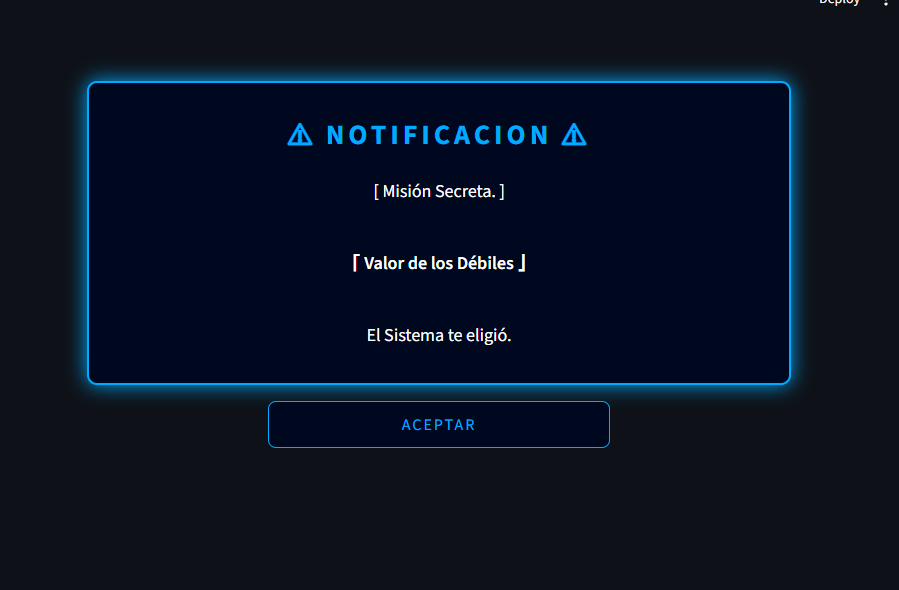

# ⚔️ System RPG — Life Gamification App

Una app de productividad personal inspirada en **Solo Leveling**.
Convertí tus hábitos diarios en misiones, subí de nivel y enfrentá las penalizaciones si fallás.

---

## 📸 Capturas

| Notificación inicial | Panel principal |
|---|---|
|  |  |

| Registro de Jugador | Level Up |
|---|---|
|  |  |

---

## ⚙️ Funcionalidades

- 🔔 **Pantalla de bienvenida:** Agregué una pantalla de bienvenida al estilo de la serie Solo Leveling como aparece por primera vez en el anime.
- 👤 **Registro de jugador:** Agregué la opción de que el jugador pueda registrarse con su nombre/apodo y aplicar su zona horaria.
- 📊 **Panel de estadísticas:** El jugador va a poder ver su Rango, Nivel, Experiencia y Días consecutivos.
- ✅ **Misiones diarias:** Agregué checkboxes y recompensas de XP para que el jugador vaya teniendo en cuenta qué le falta por completar.
- ➕ **Gestión de misiones:** El jugador puede agregar, editar y eliminar misiones para cumplir sus objetivos/hábitos personales.
- ⚡ **Sistema de buffs:** El jugador puede tener buffs por racha de días consecutivos completados (+10%, +25%, +50% XP).
- ⚠️ **Penalización:** El jugador será penalizado si no completa las misiones diarias, con pérdida de XP o misiones adicionales de castigo.
- 🆙 **Subida de nivel:** Agregué el Level Up con animación Glitch al alcanzar los días requeridos.
- 📈 **Historial:** Le agregué gráficos de XP y misiones por día.
- 🕐 **Reloj:** Agregué un reloj en tiempo real dependiendo la zona horaria del jugador.

---

## 🏆 Sistema de Rangos

| Rango | Nivel |
|-------|-------|
| E | 1 - 10 |
| D | 11 - 20 |
| C | 21 - 30 |
| B | 31 - 40 |
| A | 41 - 50 |
| S | 51+ |

---

## ⚡ Sistema de Buffs

| Racha | Buff | Bonus |
|-------|------|-------|
| 3 días | Concentración | +10% XP |
| 7 días | Determinación | +25% XP |
| 30 días | Modo Cazador | +50% XP |

---

## 🚀 ¿Cómo correrlo?

**1. Cloná el repositorio**
```bash
git clone https://github.com/nicolas-freites/system-rpg.git
cd system-rpg
```

**2. Creá un entorno virtual y activalo**
```bash
# Crear
python -m venv venv

# Activar en Windows
venv\Scripts\activate

# Activar en Mac/Linux
source venv/bin/activate
```

**3. Instalá las dependencias**
```bash
pip install -r requirements.txt
```

**4. Corré la app**
```bash
streamlit run app.py
```

La app se abre automáticamente en tu browser en `http://localhost:8501`

---

## 🛠️ Tecnologías

| Tecnología | Uso |
|------------|-----|
| Python 3.14 | Lenguaje principal |
| Streamlit | Interfaz web |
| Plotly | Gráficos interactivos |
| JSON | Persistencia de datos |
| pytz | Manejo de zonas horarias |

---

## 📁 Estructura del proyecto

```
system-rpg/
├── app.py              # Interfaz visual (Streamlit)
├── data.py             # Lógica del juego (XP, niveles, misiones)
├── requirements.txt    # Dependencias del proyecto
├── screenshots/        # Capturas de pantalla
└── README.md           # Este archivo
```

---

## 📌 Estado del proyecto

🟢 **En desarrollo activo**

- [x] Sistema de notificaciones
- [x] Registro de jugador
- [x] Sistema de XP y niveles
- [x] Misiones diarias
- [x] Buffs y penalizaciones
- [x] Historial con gráficos
- [ ] Deploy en la nube (próximamente)
- [ ] Sistema de logros

---

## 👨‍💻 Autor

**Nicolás Freites** — [@nicolas-freites](https://github.com/nicolas-freites)
